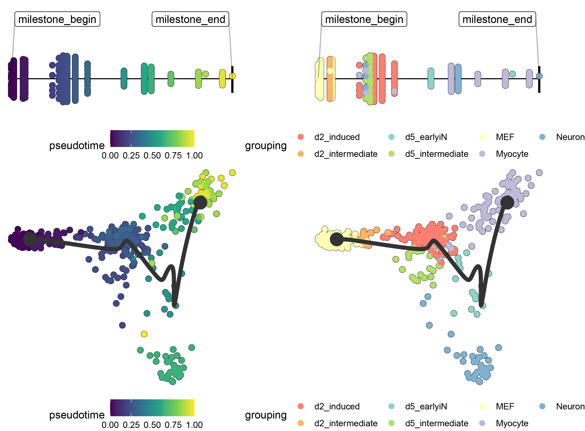
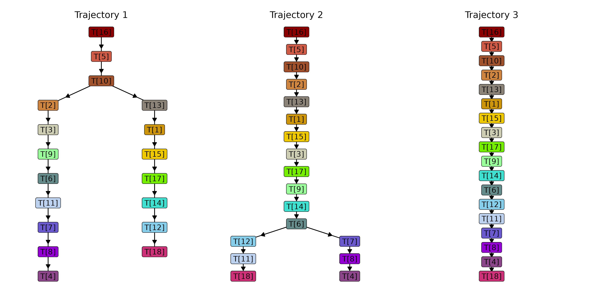
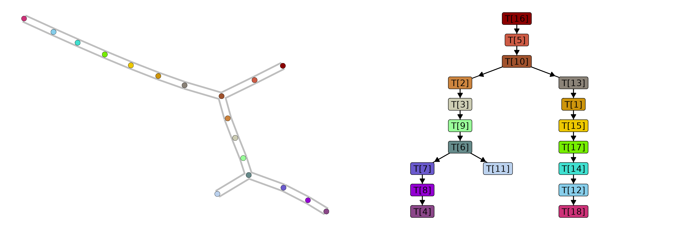
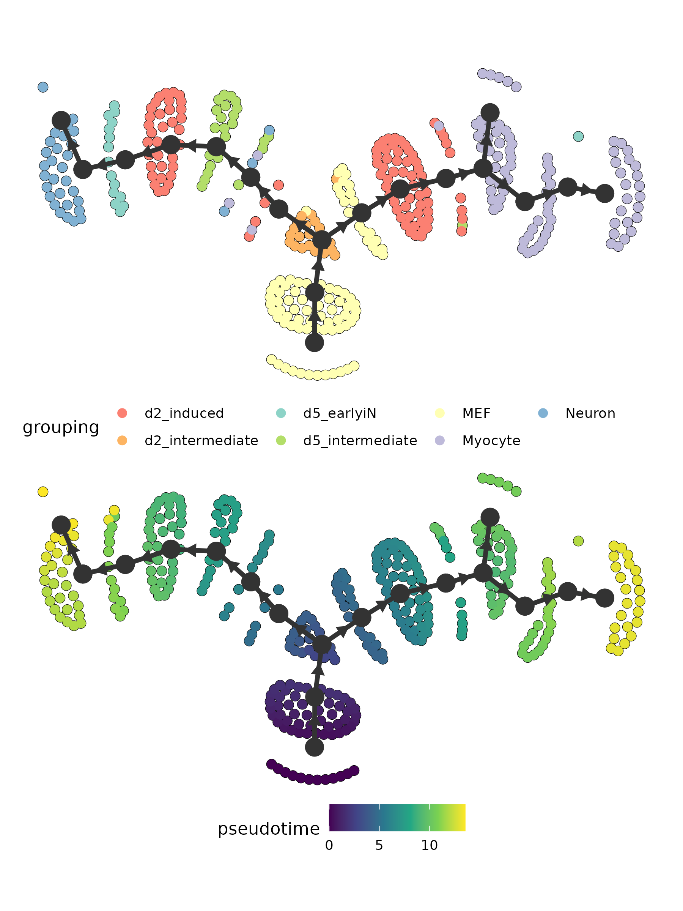

# ti_mgpfact

A Docker container dedicated to running MGPfact. The container is built on [Saelens](https://www.nature.com/articles/s41587-019-0071-9)'s trajectory prediction evaluation system and includes an integrated trajectory reconstruction process based on factorization, incorporating the execution code of [MGPfact.jl](https://github.com/renjun0324/MGPfact.jl) and [MGPfactR](https://github.com/renjun0324/MGPfactR), capable of generating trajectory visualizations for linear, binary tree, and multi-branch binary tree.

If you want to use the full functionality of MGPfact, please proceed to [MGPfactR](https://github.com/renjun0324/MGPfactR).

## pull container

```shell
docker pull renjun0324/ti_mgpfact
```

## quick start

```r
library(dynwrap)
library(dynmethods)
library(dyntoy)
library(tidyverse)
library(purrr)
library(dyno)

load("test/fibroblast_reprogramming_treutlein")

# Encapsulate the expression matrix
dataset_wrap <- wrap_expression(
  counts = fibroblast_reprogramming_treutlein$counts,
  expression = fibroblast_reprogramming_treutlein$expression
)

# If you don't want to set a root node, you can assign the `start_id` to a cell name that doesn't exist in the expression matrix or to any arbitrary string, such as 999
dataset_wrap = add_prior_information(dataset_wrap, start_id = c("1_iN2_C82"))

# create ti container
ti_mgpfact = create_ti_method_container("renjun0324/ti_mgpfact")

# running model
model = infer_trajectories(dataset_wrap, 
                           ti_mgpfact(), 
                           parameters = list(dataset_id = "myproject",
                                             max_murp = 20,
                                             trajectory_number = 3,
                                             murp_pc_number = 3,
                                             murp_pca_center = as.logical(FALSE),
                                             murp_pca_scale = as.logical(FALSE),
                                             iterations = 100,
                                             chains_number = 3,
                                             trajectory_type = "consensus_tree"),
                           verbose = TRUE, 
                           return_verbose = TRUE, 
                           debug = FALSE)
save(model, file = "model.rda")

```

## plot trajectory

When reconstructing trajectories, we can determine the type of output trajectory by changing the trajectory_type. We provide four types, namely linear, binary_tree, consensus_tree, and consensus_tree_projection. Each type of trajectory can be plotted using the functions provided by [dynplot](https://github.com/dynverse/dynplot).

### linear trajectory

```r
model_p = model$model[[1]] %>%
  add_dimred(dyndimred::dimred_mds, 
             expression_source = dataset_wrap$expression)
p1 = plot_topology(model_p) +  guides(fill = "none", color = "none") + theme(plot.margin = unit(c(0.1,0.1,0.1,0.1), "cm"))
p2 = plot_onedim(model_p, label_milestones = FALSE) + guides(fill = "none", color = "none") + theme(plot.margin = unit(c(0.1,0.1,0.1,0.1), "cm"))
p3 = plot_graph(model_p, label_milestones = TRUE) + guides(fill = "none", color = "none") + theme(plot.margin = unit(c(0.1,0.1,0.1,0.1), "cm"))
p4 = plot_dimred(model_p) +  guides(fill = "none", color = "none") + theme(plot.margin = unit(c(0.1,0.1,0.1,0.1), "cm"))
p = wrap_plots(list(p1, p2, p3, p4), nrow = 1)
ggsave("trajectory.png", p, width = 15, height = 5)
```

<div align=center></div>

### binary tree

MGPfact can extract different differentiation processes from the same data through factorization. We can output different trajectories based on the **binary_tree_index**. However, due to the limitations of the docker container, if we reconstruct three differentiation trajectories, we need to run it three times to get the results for three trajectories.

<div align=center></div>

### consensus trajectory 

The consensus trajectory representing the process of data differentiation

<div align=center></div>

### consensus trajectory  projection

Two-dimensional spatial embedding representation of consensus trajectory.

<div align=center></div>

